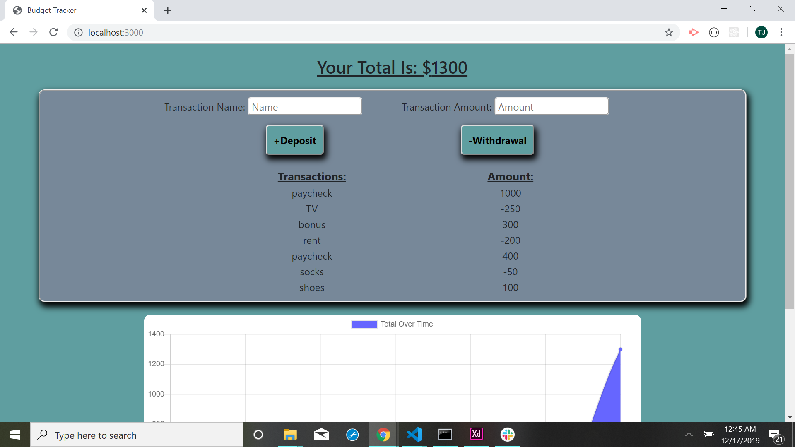

# Budget Tracker

### Description
As an avid traveler, it's very important to me that I'm able to budget and track my withdrawals and deposits over time for financial stability. Often on the road and out of service, it's vital that I be able to enter expenses even while offline and without a data connection. This way I can keep my account balance accurate and it will automatically update once I'm able to reconnect.

### Technologies-Libraries
Mongoose - Node - Express - JavaScript - [JQuery](https://code.jquery.com/jquery-3.3.1.slim.min.js) - [Bootstrap](https://getbootstrap.com/) - CSS - HTML

### Screenshots

.png)

### Link
Check it out!
https://github.com/Tjcheetham/budgetTracker/.
